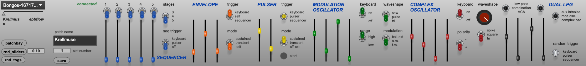

# Max for Live Buchla Program Manager
A Max for Live device that interfaces with the Buchla Program Manager Card.

# Description
This is not a wholesale replacement for the Buchla Program Manager App. It does, however, allow a lot of the same functions and shares the database with the Preset Manager App. While the space allotted for a M4L device radically changes the interface, it does allow automation and MIDI mapping of parameters in Live. You can use automation in your Live set to trigger randomizations and other changes, too.

Due to speed limitations, it's best to limit the amount of automation data sent to the Program Manager Card. There is an option to automatically limit the message density, but this will get turned off anytime a preset is recalled, since all messages must be sent for preset recall.

Besides access to the parameters and patch bay, you can also perform special operations on the presets. For example, you can crossfade the slider settings between the current and previously selected presets. You can also add random variation expressed as a percentage amount of deviation of all the current slider values. You can randomize the sliders wholesale or on a per-section basis. There is also random patching in the patchbay. Click the random button to create a random connection. You can undo those patches too.

There are four LFOs that can be assigned. These are very useful tools for incorporating a sound with modulation that is synchronized to the tempo of your Live project.

There is an experimental feature to use a menu to sync the Envelope and Pulser times to your Live Tempo. Due to variations in Easel modules, it probably isn't accurate.

You can save patches you make to the Program Manager database, and they will appear in the Buchla Program Manager App the next time you open it.

Because this device is open source, it provides access to all the sysex strings that address the parameters and connections available in the Program Manager Card, so you can dream up your own weird ideas of how to control your Easel Command.
