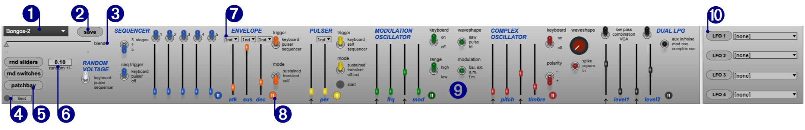
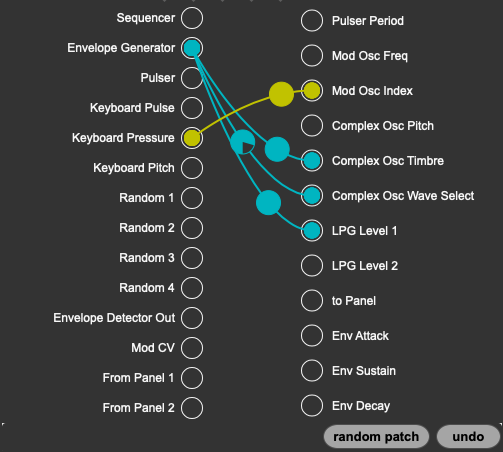
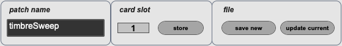
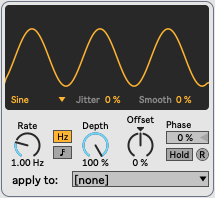

## Buchla Program Manager Max for Live Device

While the Buchla Program Manager desktop app is your central hub for creating and managing presets, we’ve created a Max for Live device that gives you deep control of your Easel sound module from within Live. The Max for Live device accesses all the presets available in the desktop app, and allows you to save new ones. You can also save presets to memory slots on the Card, too. Unlike the App, however, there is no tagging or organization features.

The Max for Live device makes it so all parameters are exposed to automation lanes in your Live Set so you can change the sound of the Easel in a way that is deeply integrated into your music. A variety of random operations give you the opportunity to find new variations on a preset. LFOs give you modulations that can be synchronized to your set’s tempo. You can blend the slider settings between two presets to create gradual changes in sound.

Ultimately, the device is designed to make the Easel Command an extension of your set, allowing you unprecedented control over your Buchla hardware.

## Interface

1. **Select a preset** - Any preset you’ve saved in the desktop app is available here. Once selected, the preset data is sent to the Easel sound module and ready for play.
2. **Save** - Click to open a window with options for saving the preset to the card, as a new preset to the database, or updating the preset you loaded from the menu.
3. **Blend** - The previous and current preset are on the ends of this slider. Move the slider to blend the slider settings of the two presets.
4. **MIDI indicator and data limiter** - When MIDI data is going to the program manager card, the indicator will blink blue. This M4L device will queue up messages and spread them out over time. For example, the “blend” slider sends out a LOT of data. You’ll notice this indicator will blink for a bit after you stop using the slider. You can use the “limit” button to reduce the amount of messages that go to the program card, at the expense of losing some data. When you select a preset, the “limit” button is turned off, since all data must get to the program card for a proper preset recall.
5. **Patchbay** - Opens the patchbay window. This gives you all the connections that you’d find on the front of the Easel sound module. In addition, there is a dial on each patchcord to allow you to give it depth and inversion.
6. **Randomize** - These are the global randomize functions. The “amount” number sets a percentage of variation. For example pressing the “rnd sliders” button means all the sliders will get a value of _(0.1 x maximum slider value)_ added or subtracted to the current value. The amount has no effect on the “rnd switches” button, which simply flips the switches to random positions. Beware: This may result in silence!
7. **Time Sync** - These menus above the Envelope Generator and Pulser Period sliders attempt to synchronize the times to the selected division of the current tempo of your Live set. It probably isn’t accurate.
8. **Local Random or !!** - The color coded “!!” buttons in each section of the Easel sound module will randomize the sliders for only that section, according to the amount set in the global randomize amount
9. **The Easel Interface** - All the front panel controls of the Easel sound module are replicated, albeit in a way to accommodate the strange aspect ratio of a Max for Live device.
10. **LFOs **- Click the “LFO” buttons to open windows to configure an LFO. You can select the destination for the modulator using the menus in the window or on the device’s main interface.

### Patchbay

Click and drag connections to create patches. The “dial” on the patch cord allows you to set depth. When the dial is completely full, that is a depth of “1”. When it’s half full (or half-empty), that has a depth of “0” and will have no effect. When the dial is empty of color, it will invert the modulator’s values sent to the patched source.

If you are feeling lucky, use the “random patch” button to create a random connection with random depth. Go ahead, click it a few times. If you don’t like it, you can undo all your random connections with the “undo” button.

### Save

Name your patch, then decide if you want to save to a slot on the card, save it as a new preset, or update the current preset. You can do them all if you like	! If you save to a “file”, it will be available in the desktop app next time you open it. Cool!

### LFO

Lots of controls, the same as Live’s own LFO device.
